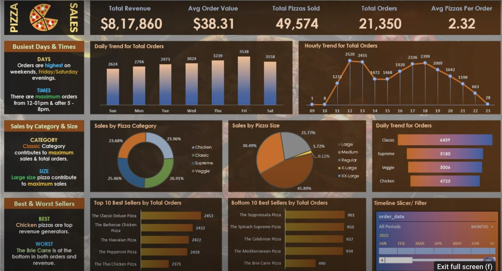

# Pizza Sales Dashboard

## 📊 Overview
This project involves creating an **interactive dashboard** in **Excel** to analyze pizza sales data. The dashboard provides key insights into sales performance, customer preferences, and trends to support data-driven decision-making.

---

## 📌 Problem Statement
The goal of the project is to analyze key performance indicators (KPIs) for the pizza business. The following metrics are calculated and visualized:

1. **Total Revenue**: The sum of the total price of all pizza orders.
2. **Average Order Value**: The average amount spent per order, calculated as:
3. **Total Pizzas Sold**: The sum of all pizza quantities sold.
4. **Total Orders**: The total number of orders placed.
5. **Average Pizzas Per Order**: The average number of pizzas sold per order, calculated as:

---

## 📅 Insights Provided
The dashboard highlights several insights, including:
- **Busiest Days and Times**:
- Highest orders occur on weekends, particularly **Friday/Saturday evenings**.
- Peak order times are from **12:00 PM to 1:00 PM** and **5:00 PM to 8:00 PM**.

- **Sales by Category & Size**:
- The **Classic category** contributes the most to both sales and total orders.
- **Large-sized pizzas** generate the highest revenue.

- **Best & Worst Sellers**:
- **Best Seller**: Chicken pizzas are the top revenue generators.
- **Worst Seller**: The Brie Carre ranks lowest in both orders and revenue.

- **Daily and Hourly Trends**:
- Orders peak during **Thursday-Friday** and fall during late evenings (after 9 PM).

---

## 🛠️ Tools Used
- **Microsoft Excel**:
- Pivot tables and slicers for data analysis.
- Charts and graphs for visualizations.
- Conditional formatting for emphasis.
- **Data Source**: Pizza sales dataset with details such as revenue, order size, pizza categories, and order timestamps.

---

## 📈 Dashboard Features
The dashboard contains the following sections:
1. **Key Metrics**:
- Total Revenue
- Average Order Value
- Total Pizzas Sold
- Total Orders
- Average Pizzas Per Order

2. **Trends**:
- Daily and hourly trends for total orders.
- Sales distribution by category and size.

3. **Best and Worst Sellers**:
- Top 10 best and worst-selling pizzas by total orders.

4. **Filters**:
- Timeline slicers for filtering data by month and year.

---

## 🔍 Screenshots
### Dashboard:

---

## 📚 Learnings
This project demonstrates:
- Data cleaning and preparation for visualization.
- Advanced Excel skills, including pivot tables and slicers.
- Business insights extraction from raw data.

---

## 📝 License
This project is for educational purposes and is not intended for commercial use.

---

